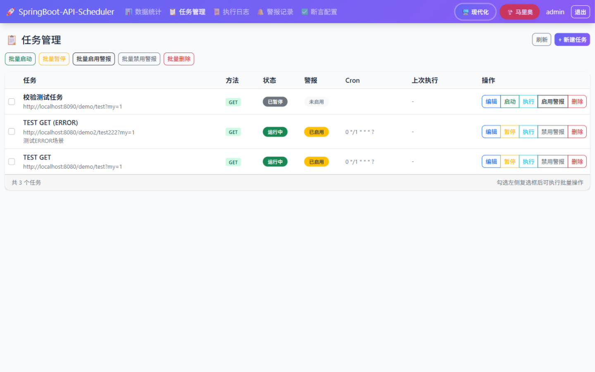
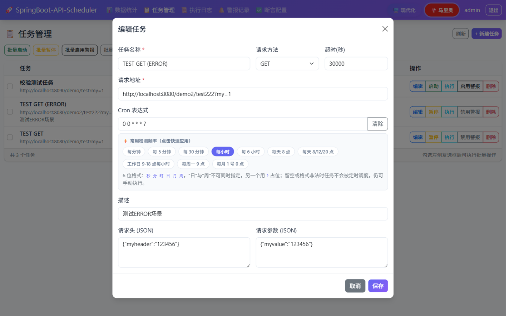
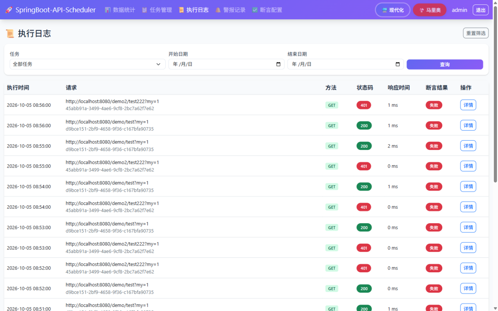
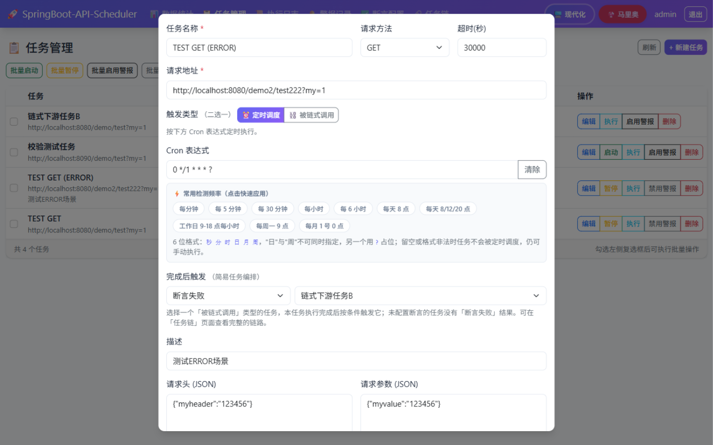
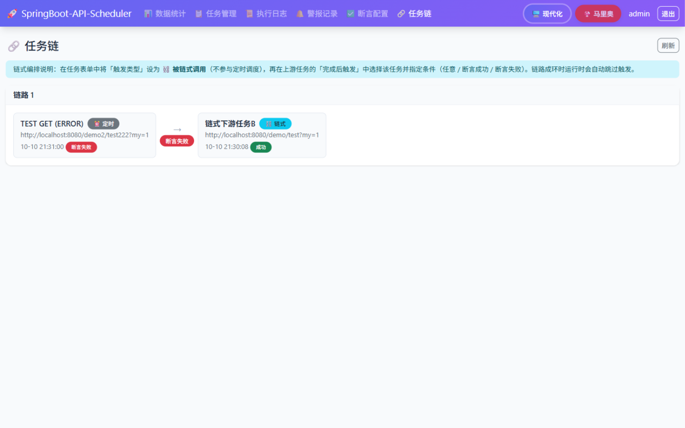
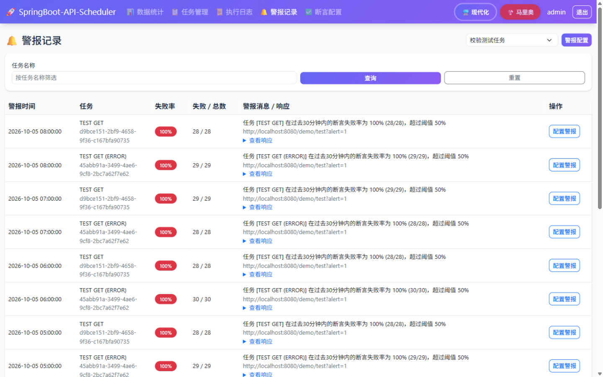
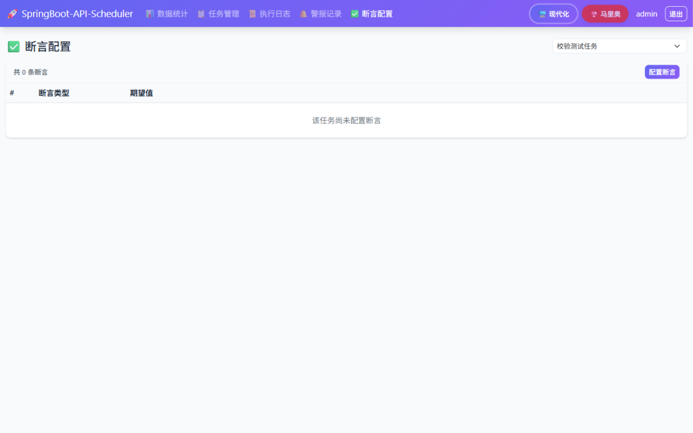

# API Scheduler 前端说明文档

> 前端已从 Vue3 SPA 完全改造为 **Thymeleaf 服务端渲染 + HTMX 局部刷新 + Alpine.js 轻交互** 的多页应用（MPA）。
> 无需 Node 构建链，所有页面由 Spring Boot 直接渲染，交互以局部片段更新为主。

---

## 🚀 技术栈

| 层 | 技术 | 说明 |
|---|---|---|
| 模板引擎 | Thymeleaf 3.1 | 服务端渲染完整页面与 HTMX 片段 |
| 局部刷新 | HTMX 1.9.12 | 表格筛选、分页、模态框加载、行内操作 |
| 轻交互 | Alpine.js 3.14 | 主题切换 store、Cron 快速选择助手 |
| UI 基础 | Bootstrap 5.1.3 | 栅格、表格、模态框、表单组件 |
| 主题 | CSS 变量 + `data-theme` | 现代化 / 马里奥像素风双主题，详见 [THEME_GUIDE.md](THEME_GUIDE.md) |

CDN：Bootstrap / Alpine / htmx 统一走 jsdelivr，字体走 Google Fonts。`layout.html` 中对本项目 CSS 引用带版本参数（`themes.css?v=1.1`），更新样式后递增版本号即可避免浏览器缓存旧样式。

## 📁 项目结构

```
src/main/resources/
├── templates/
│   ├── layout.html              # 公共布局片段：head(title) / navbar(active) / scripts
│   ├── login.html               # 登录页
│   ├── dashboard.html           # 数据统计
│   ├── tasks.html               # 任务管理
│   ├── logs.html                # 执行日志
│   ├── alerts.html              # 警报记录
│   ├── assertions.html          # 断言配置
│   └── fragments/               # HTMX 片段（局部刷新的返回内容）
│       ├── dashboard-stats.html # 统计卡片 + 趋势/分布表
│       ├── task-list.html       # 任务表格
│       ├── task-form.html       # 任务新建/编辑表单（含 Cron 助手）
│       ├── log-list.html        # 日志表格（分页）
│       ├── log-detail.html      # 日志详情模态框内容
│       ├── alert-list.html      # 警报记录表格
│       ├── alert-config.html    # 警报配置表单
│       ├── assertion-list.html  # 断言列表
│       └── assertion-form.html  # 断言编辑表单
└── static/css/
    └── themes.css               # 双主题变量 + 全部自定义组件样式
```

页面控制器：`XxxPageController` 提供 `GET /xxx`（完整页面）与 `GET /web/xxx/*`（HTMX 片段）两类端点。

## 🖼️ 模块一览

### 登录

表单 POST 到 `/web/auth/login`，成功后重定向 `/dashboard`；未登录访问由 `AuthInterceptor` 处理：HTMX 请求返回 401 + `HX-Redirect: /login`，页面请求直接 302。


### 数据统计（/dashboard）

概览卡片 + 每日趋势 + 状态/响应码分布。右上角筛选（天数 / 任务）通过 HTMX 请求 `/web/dashboard/stats`，返回片段整体替换 `#dashboardStats`。


### 任务管理（/tasks）

系统核心页面：批量操作栏、任务表格、行内操作（启动/暂停/执行/警报开关/删除）、新建与编辑模态框。



**Cron 快速选择助手**：任务表单中 Cron 输入框独立成行并带「清除」按钮，下方提供常用检测频率样例（每分钟、每 5 分钟、每小时、每天 8/12/20 点、工作日 9-18 点、每周一、每月 1 号等），点击即写入输入框；与当前值完全匹配的样例会高亮显示。实现为 Alpine 组件：`x-data` 承载 `cron` 状态，`x-model` 双向绑定输入框，样例按钮 `@click="cron = '...'"`、`:class` 高亮。



### 执行日志（/logs）

按任务 / 起止日期筛选，服务端分页（`pageLinks` 由控制器预生成 URL，模板零表达式拼装）；「详情」打开 HTMX 加载的日志详情模态框。



### 任务链（/chains）—— 简易任务编排

在任务表单中可将任务配置为链式触发：

- **触发类型**（二选一）：`⏰ 定时调度`（按 Cron 执行）或 `⛓️ 被链式调用`（不参与定时调度，仅由上游触发或手动执行）
- **完成后触发**：选择条件（任意 / 断言成功 / 断言失败）和下游任务（仅「被链式调用」类型的任务可选），本任务执行完成后按条件触发下游



「任务链」页面以链头（定时任务或未被引用的链式任务）为起点展开完整链路，箭头上标注触发条件，每个节点显示最近一次执行结果；游离的链式任务（暂无上游引用）单独列出，成环时标记并截断展示。



实现要点：`api_task` 表通过 `trigger_type` / `next_task_id` / `trigger_condition` 三列描述编排关系；触发逻辑在 `TaskSchedulerServiceImpl.triggerNextTask()`（任务执行落库后异步触发下游，携带已访问集合防环）；条件语义——任意 = 执行完成即触发，断言成功 = `SUCCESS` 且断言全通过（未配置断言视为通过），断言失败 = 断言未全通过（未配置断言时永不触发）。

### 警报记录（/alerts）

按任务名称筛选、分页；顶部「警报配置」将选中的任务带入 HTMX 配置表单（阈值、检查间隔、通知 API、请求头/体模板变量）。



### 断言配置（/assertions）

下拉切换任务（`hx-trigger="change"`）加载该任务的断言列表；支持编辑（每个任务一条断言）与清空。



---

## 🧩 核心模式

### 1. 布局片段（layout.html）

公共 `<head>`、导航栏、全局脚本拆成三个 fragment，页面通过 `th:replace` 组装：

```html
<head th:replace="~{layout :: head('任务管理')}"></head>
<nav th:replace="~{layout :: navbar('tasks')}"></nav>
...
<div th:replace="~{layout :: scripts}"></div>
```

`head(title)` 负责元信息、CDN 引入与**主题预加载脚本**（读取 localStorage 提前设置 `data-theme`，避免闪烁）；`scripts` 包含 Bootstrap JS、Alpine 主题 store、全局 `appToast` / `appCloseModal` 工具与 htmx 错误统一处理。

### 2. HTMX 局部刷新

页面里声明触发器与目标，控制器返回**片段模板**：

```html
<!-- 页面：筛选表单整体作为一个 htmx 触发器 -->
<form hx-get="/web/logs/list" hx-target="#logTable" hx-swap="outerHTML">
```

```java
@GetMapping("/web/logs/list")
public String list(...) {
    fill(model, ...);
    return "fragments/log-list :: table";   // 只返回片段
}
```

约定：

- 片段根节点自带与 `hx-target` 一致的 id（如 `#taskTable`），配合 `outerHTML` 实现自替换，刷新后的行内按钮无需重新绑定。
- 模态框采用「空壳 + 懒加载」：页面放置空的 `.modal-content`，按钮 `data-bs-toggle="modal"` 同时 `hx-get` 片段 `innerHTML` 注入。
- 操作成功后的提示与收尾：控制器往模型里放 `message`，片段内置脚本 `window.appToast(message)` + `window.appCloseModal()`（htmx 默认会执行交换内容中的 `<script>`）。
- 失败提示由 layout 中全局 `htmx:responseError` 监听兜底（401 跳登录，其余 toast 报错）。

### 3. Alpine.js 使用范围

- **主题切换**：`Alpine.store('theme')` + `$store.theme.set('mario')`，按钮 active 态用 `:class` 绑定。
- **Cron 助手**：`task-form.html` 内 `x-data="{ cron: '...' }"`（初始值由 Thymeleaf 注入 `task?.cronExpression`，编辑时正确回显）。
- 其余逻辑（分页、筛选、提交）全部交给 HTMX + 服务端，不引入前端状态管理。

### 4. Cron 表达式约定

6 位 Quartz/Spring 格式：`秒 分 时 日 月 周`，「日」与「周」二选一，另一个用 `?` 占位。常用样例：

| 频率 | 表达式 |
|---|---|
| 每分钟 | `0 * * * * ?` |
| 每 5 / 30 分钟 | `0 0/5 * * * ?` / `0 0/30 * * * ?` |
| 每小时 / 每 6 小时 | `0 0 * * * ?` / `0 0 0/6 * * ?` |
| 每天 8 点 / 每天 8、12、20 点 | `0 0 8 * * ?` / `0 0 8,12,20 * * ?` |
| 工作日 9-18 点每小时 | `0 0 9-18 ? * MON-FRI` |
| 每周一 9 点 | `0 0 9 ? * MON` |
| 每月 1 号 0 点 | `0 0 0 1 * ?` |

留空或非法时任务不会被定时调度（`CronTrigger` 抛错被捕获，仅记录日志），仍可手动执行。

### 5. 主题系统

`themes.css` 用 CSS 变量定义两套主题（`:root[data-theme="modern"]` / `:root[data-theme="mario"]`），组件样式全部走变量；切换即时生效并持久化到 localStorage。设计与扩展指南见 [THEME_GUIDE.md](THEME_GUIDE.md)。

现代化主题（默认）：


马里奥像素风主题：


---

## 🎨 样式约定（themes.css）

- 组件级自定义样式：`.method-get/post/put/delete/patch` 请求方法徽章、`.theme-btn` 主题切换按钮、`.cron-chip` / `.cron-helper` Cron 助手、`.task-card` 等。
- 通用修正：`.btn` 恢复 `white-space: nowrap`（Bootstrap 5 移除了它，窄列中文按钮会逐字竖排）；导航链接同理。
- 马里奥主题专门处理：像素字体较宽，`.table td` 不换行（长 URL 由 `.text-break` 子元素折行）、导航栏允许折行防撑破视口、`pre` 底色适配羊皮纸背景。
- 表格卡片（整页大卡片）hover 仅加深阴影不位移，网格内统计卡片保留上浮效果。

## 📝 开发注意事项

1. **Thymeleaf 表达式 null 安全**：对可空 Boolean（如 `task.alertEnabled`）取反会抛 `EL1001E` 导致整页 500，务必写成 `task.alertEnabled == null or !task.alertEnabled`；新任务由 `ApiTaskServiceImpl.save()` 兜底设置默认值。
2. **新增页面步骤**：建 `templates/xxx.html`（复用 layout 三片段）→ 建对应片段 → 控制器提供页面端点与 `/web/xxx/*` 片段端点 → 导航栏加菜单项。
3. **片段内 script**：htmx 交换时会执行，适合放置「toast + 关模态框」这类随片段到达的收尾逻辑；不要注册全局事件监听（会随多次刷新重复执行）。
4. **更新静态资源后**：递增 `layout.html` 中的 `themes.css(v=x)` 版本号，否则浏览器可能继续使用缓存样式。
5. 表单内的样例按钮必须 `type="button"`，防止触发表单提交。
