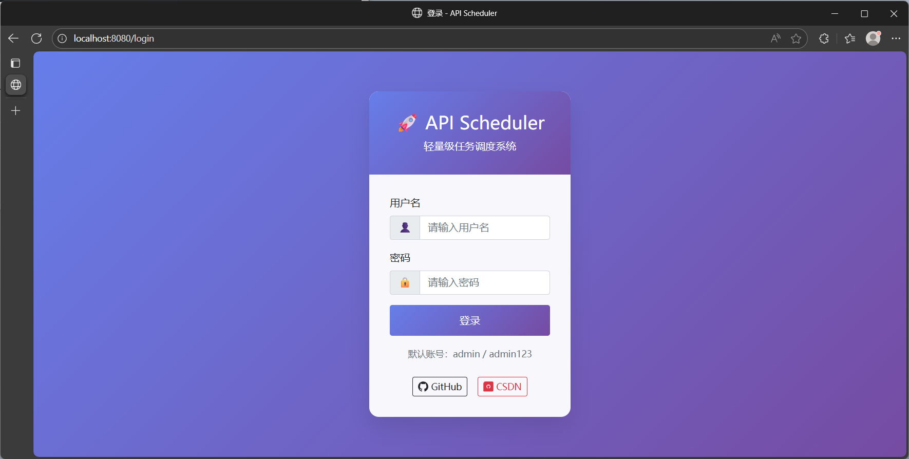
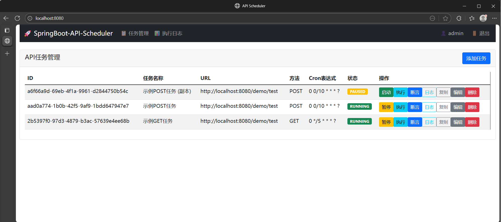
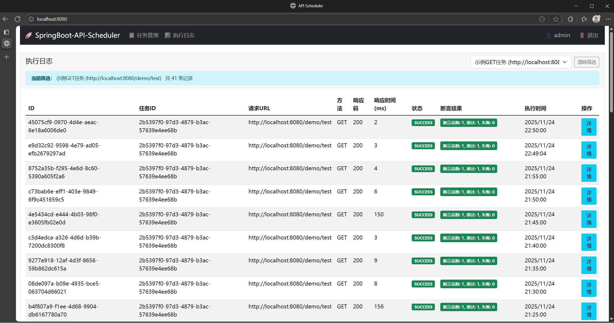
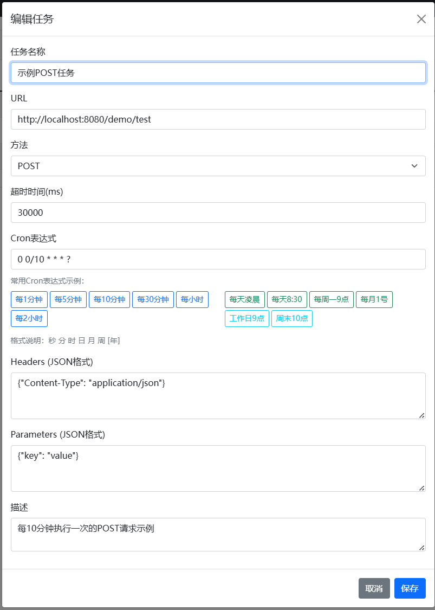
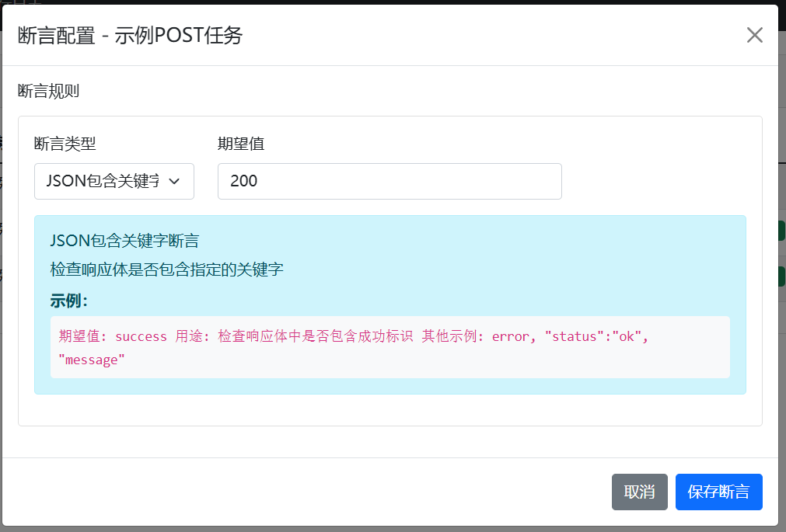
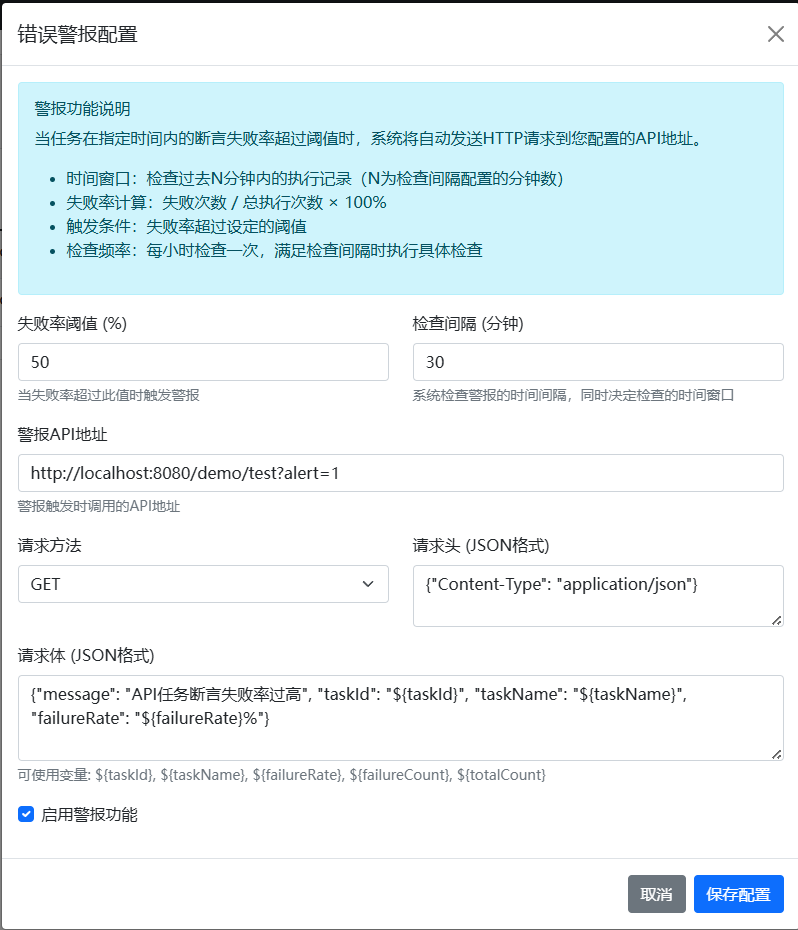
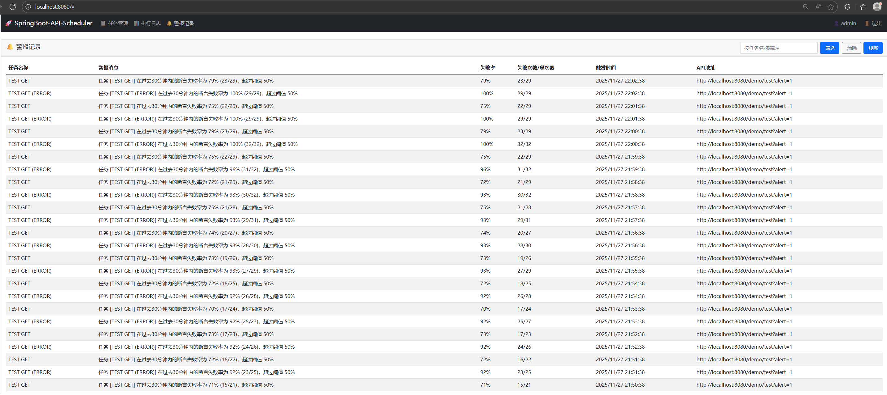

# SpringBoot-API-Scheduler
又叫`EasyApiTaskScheduler`，一个基于SpringBoot的API任务调度系统，支持定时执行HTTP请求并记录响应日志。

🚀 **轻量级API任务调度系统** - 简单、高效、易用


😭**厌倦了庞大的任务调度框架？**  
🤔如果你只是需要定时调度一个API任务，却要安装配置XXL-JOB、Quartz等重量级框架？  
😄**No! 现在有了更加简单易用、轻量级的解决方案！**
➡️**SpringBoot-API-Scheduler** 专为API调度而生，开箱即用，零学习成本！


### 🎯 核心优势

- **📦 轻量级**: 无需复杂配置，一个SpringBoot应用搞定
- **⚡ 高性能**: 基于OkHttp3，支持连接池、超时控制
- **🎨 美观UI**: Bootstrap + Vue3，现代化管理界面
- **🔧 易维护**: 标准SpringBoot架构，代码清晰易懂
- **📊 完整日志**: 详细的请求响应记录，便于问题排查
- **🔄 热更新**: 支持动态添加/修改任务，无需重启服务
- **✅ 断言验证**: 支持对API响应结果进行断言验证
- **🔔 警报通知**: 支持基于断言失败率的警报通知机制

### 📷 系统截图
登录<br>
<br>
任务列表<br>
<br>
日志<br>
<br>
任务详情<br>
<br>
断言<br>
<br>
警报设置<br>
<br>
警报记录<br>
<br>

## 🏆Author作者
Powered by Moshow郑锴 , Show more on CSDN https://zhengkai.blog.csdn.net/ | 公众号【软件开发大百科】


---

## 🛠 技术栈

### 后端技术
- **Spring Boot 3.5.8** - 最新稳定版，性能卓越
- **MyBatis 3.5.19** - 轻量级ORM框架
- **OkHttp 4.12.0** - 高性能HTTP客户端
- **FastJSON2 2.0.x** - 高效JSON处理
- **PostgreSQL** - 可靠的关系型数据库
- **Log4j2** - 强大的日志框架

### 前端技术
- **Bootstrap 5.1.3** - 响应式UI框架
- **Vue 3** - 渐进式JavaScript框架
- **Axios** - HTTP请求库

---

## ✨ 功能特性

### 🎯 任务管理
- ✅ **动态任务管理** - 随时添加/修改/删除API任务
- ✅ **HTTP方法支持** - GET/POST请求全覆盖
- ✅ **自定义配置** - Headers、Parameters完全可控
- ✅ **智能调度** - Cron表达式定时调度，内置丰富模板
- ✅ **实时控制** - 启动/暂停/立即执行，一键操作

### 📊 日志监控
- ✅ **完整记录** - 请求URL、方法、Headers、参数全记录
- ✅ **响应详情** - HTTP状态码、响应体、响应时间精确统计
- ✅ **错误追踪** - 异常信息详细记录，便于问题定位
- ✅ **历史查询** - 支持分页查询，历史记录一目了然

### ✅ 断言验证 (Assertion)
- ✅ **多种断言类型** - 支持HTTP状态码、JSON包含关键字、JSON路径等多种断言方式
- ✅ **灵活配置** - 可以为每个任务独立配置断言规则
- ✅ **结果展示** - 在日志中直观显示断言结果（通过/失败）
- ✅ **详细报告** - 提供详细的断言执行报告，包括期望值和实际值

### 🔔 警报通知 (Alert)
- ✅ **失败率监控** - 基于断言失败率触发警报
- ✅ **灵活配置** - 可配置失败率阈值和检查时间窗口
- ✅ **外部通知** - 支持向指定API地址发送警报通知
- ✅ **记录跟踪** - 完整的警报记录，便于后续分析

### 🎨 用户体验
- ✅ **现代化UI** - 简洁美观的管理界面
- ✅ **Cron助手** - 预设常用Cron表达式，点击即用
- ✅ **响应式设计** - 完美适配各种屏幕尺寸
- ✅ **实时状态** - 任务状态实时更新

---

## 🚀 快速开始

### 1️⃣ 环境准备
```bash
# 确保已安装
- OpenJDK 17+ (推荐MSJDK或者AWSJDK)
- Maven 3.6+
- PostgreSQL 12+
- Git
# 可选
- IDEA/VSCode或者其他AI IDE
- DBeaver/Navicat/PgAdmin等DB管理工具
- GitDesktop
```

### 2️⃣ 数据库初始化
```bash
# 创建数据库
CREATE DATABASE api_scheduler;

# 执行初始化脚本
psql -U postgres -d api_scheduler -f src/main/resources/sql/init.sql
```

### 3️⃣ 配置数据库连接
编辑 `src/main/resources/application.yml`：
```yaml
spring:
  datasource:
    url: jdbc:postgresql://localhost:5432/api_scheduler
    username: your_username
    password: your_password
```

### 4️⃣ 启动应用
```bash
# 方式一：Maven启动
mvn spring-boot:run

# 方式二：编译后启动
mvn clean package
java -jar target/springboot-api-scheduler-1.0-SNAPSHOT.jar
```

### 5️⃣ 访问系统
打开浏览器访问：**http://localhost:8080**
默认用户名密码：`admin`/`admin123`

---

## 📖 使用指南

### 🎯 创建你的第一个API任务

1. **点击"添加任务"按钮**
2. **填写基本信息**：
   - 任务名称：`TEST DEMO API`
   - URL：`http://localhost:8080/demo/test?my=1`
   - 方法：`GET`
3. **设置定时规则**：
   - 点击"每30分钟"按钮自动填充Cron表达式
4. **保存并启动任务** 🎉

### ✅ 配置断言验证 ([ASSERTION_GUIDE.md](ASSERTION_GUIDE.md))

1. **进入任务管理页面**
2. **点击对应任务的"断言"按钮**
3. **配置断言规则**：
   - 选择断言类型（HTTP状态码、JSON包含关键字、JSON路径）
   - 输入期望值
4. **保存断言配置**

### 🔔 配置警报通知 ([ALERT_GUIDELINE.md](ALERT_GUIDELINE.md) )

1. **进入任务管理页面**
2. **点击"警报配置"按钮**
3. **配置警报参数**：
   - 设置失败率阈值（如50%）
   - 设置检查时间窗口（如30分钟）
   - 配置接收警报的API地址
   - 设置请求方法、请求头和请求体
4. **启用警报功能**
5. **保存配置**

### 📋 Cron表达式模板

我们为你准备了常用的Cron表达式模板：

⏰ **高频执行**
- 每1分钟：`0 */1 * * * ?`
- 每5分钟：`0 */5 * * * ?`
- 每30分钟：`0 */30 * * * ?`

📅 **定时执行**
- 每天凌晨：`0 0 0 * * ?`
- 每天8:30：`0 30 8 * * ?`
- 工作日9点：`0 0 9 ? * MON-FRI`

---

## 🔧 API接口文档

### 任务管理接口
```http
GET    /api/tasks              # 获取所有任务
POST   /api/tasks              # 创建新任务
PUT    /api/tasks/{id}         # 更新任务
DELETE /api/tasks/{id}         # 删除任务
POST   /api/tasks/{id}/start   # 启动任务
POST   /api/tasks/{id}/pause   # 暂停任务
POST   /api/tasks/{id}/execute # 立即执行任务
```

### 日志查询接口
```http
GET    /api/responses          # 获取执行日志
GET    /api/responses/task/{taskId}  # 获取指定任务日志
```

### 警报相关接口
```http
POST   /api/alert/config       # 保存警报配置
GET    /api/alert/config/{taskId} # 获取任务警报配置
POST   /api/alert/enable/{taskId} # 启用任务警报
POST   /api/alert/disable/{taskId} # 禁用任务警报
GET    /api/alert/records/{taskId} # 获取任务警报记录
GET    /api/alert/records      # 获取所有警报记录（支持筛选和分页）
```

### 测试接口
```http
GET    /demo/test              # GET测试接口
POST   /demo/test              # POST测试接口
GET    /demo/echo              # GET回显接口
POST   /demo/echo              # POST回显接口
```

---

## 📁 项目结构

```
springboot-api-scheduler/
├── 📂 src/main/java/com/software/dev/
│   ├── 📂 controller/         # REST控制器
│   ├── 📂 entity/            # 实体类
│   ├── 📂 mapper/            # MyBatis Mapper
│   ├── 📂 service/           # 业务逻辑层
│   ├── 📂 listener/          # 应用监听器
│   └── 📄 Main.java          # 启动入口
├── 📂 src/main/resources/
│   ├── 📂 mapper/            # SQL映射文件
│   ├── 📂 sql/               # 数据库脚本
│   ├── 📂 static/            # 静态资源
│   ├── 📂 templates/         # 页面模板
│   ├── 📄 application.yml    # 应用配置
│   └── 📄 log4j2.xml         # 日志配置
├── 📄 pom.xml                # Maven配置
└── 📄 README.md              # 项目文档
```

---

## ⚙️ 配置说明

### 🎛 mybatis配置 (application.yml)
```yaml
mybatis:
  mapper-locations: classpath:mapper/*.xml
  type-aliases-package: com.software.dev.entity
```

### 📝 日志配置 (log4j2.xml)
- 支持控制台和文件双重输出
- 日志文件按日期滚动存储
- 可配置日志级别和格式

---

## 🎯 使用场景

### 📊 数据采集
- 定时抓取第三方API数据
- 监控接口可用性
- 数据同步任务

### 🔔 系统监控
- 服务健康检查
- 性能指标收集
- 异常告警通知

### 🔄 业务自动化
- 定时发送邮件/短信
- 数据报表生成
- 缓存预热任务

---

## 🚀 性能特点

- **⚡ 启动快速** - SpringBoot原生优势，秒级启动
- **💾 内存占用低** - 轻量级架构，资源消耗少
- **🔄 高并发支持** - 异步任务调度，支持大量并发任务
- **📈 可扩展** - 标准SpringBoot架构，易于扩展


---

## 📋 更新日志

### v2.0 (2025~Now)
✨ spring-boot-UrlTaskScheduler全新改名为springboot-api-scheduler

| 日期         | 更新内容                                                                                                            |
|------------|-----------------------------------------------------------------------------------------------------------------|
| 2025-11-27 | ✅ Alert警报功能上线 [ALERT_GUIDELINE.md](ALERT_GUIDELINE.md)  🔧 GET请求当请求方法为GET且存在参数配置时，将自动将parameters中的键值对转换为URL查询参数 |
| 2025-11-26 | 🔧 修复日志界面筛选和分页功能                                                                                                |
| 2025-11-25 | 🆙 日志界面新增日期查询功能以及刷新功能、刷新1s防抖功能、分页功能                                                                             |
| 2025-11-24 | 🔧 修复Maven打包JAR问题 🔧 OkHttpClient配置忽略SSL 🆙 日志界面支持筛选功能,也支持从任务列表点击日志功能跳转 🆙 任务列表界面新增复制功能,一键复制API 🆙 断言设置指引优化     |
| 2025-11-23 | ✅ 断言功能重构 [ASSERTION_GUIDE.md](ASSERTION_GUIDE.md)                                                               |
| 2025-11-22 | ✅ 重构项目 ✅ 用户登录功能                                                                                                 |


### v1.0 (2019~2022)
| 日期 | 更新内容 |
|------|----------|
| 2022-11-26 | 回滚页面到旧版本并进行优化 |
| 2022-03-06 | 实现响应推断处理逻辑，优化UI显示逻辑 |
| 2022-02-25 | 修复Token页面，新增Assumption内容 |
| 2022-02-20 | 基于墨菲安全进行安全扫描，更新相关依赖 |
| 2021-03-28 | 优化以及修复请求、响应，UI优化，修复执行问题，新增登录功能 |
| 2021-03-27 | 重启项目2.0版本，UI改版，UrlRequest优化 |
| 2019-04-28 | UrlPlus之Url追加Token参数功能，token配置功能，优化gitignore |
| 2019-04-11 | 优化管理页面，修复一些细节问题，新增日志查看功能，新增travis |
| 2019-04-07 | 优化核心模块核心状态的封装，包含状态变更简化，管理界面优化 |
| 2019-04-03 | UrlJob里面的Log信息优化 |
| 2019-03-18 | 一些简单的页面 |
| 2019-03-15 | 分离新旧接口，新封装的再UrlTaskController里面，quartz原生的在JobController里面 |

---

## 🤝 贡献指南

欢迎提交Issue和Pull Request！

1. Fork 本项目
2. 创建特性分支 (`git checkout -b feature/AmazingFeature`)
3. 提交更改 (`git commit -m 'Add some AmazingFeature'`)
4. 推送到分支 (`git push origin feature/AmazingFeature`)
5. 开启 Pull Request

---

## 📄 开源协议

本项目采用 MIT 协议 - 查看 [LICENSE](LICENSE) 文件了解详情