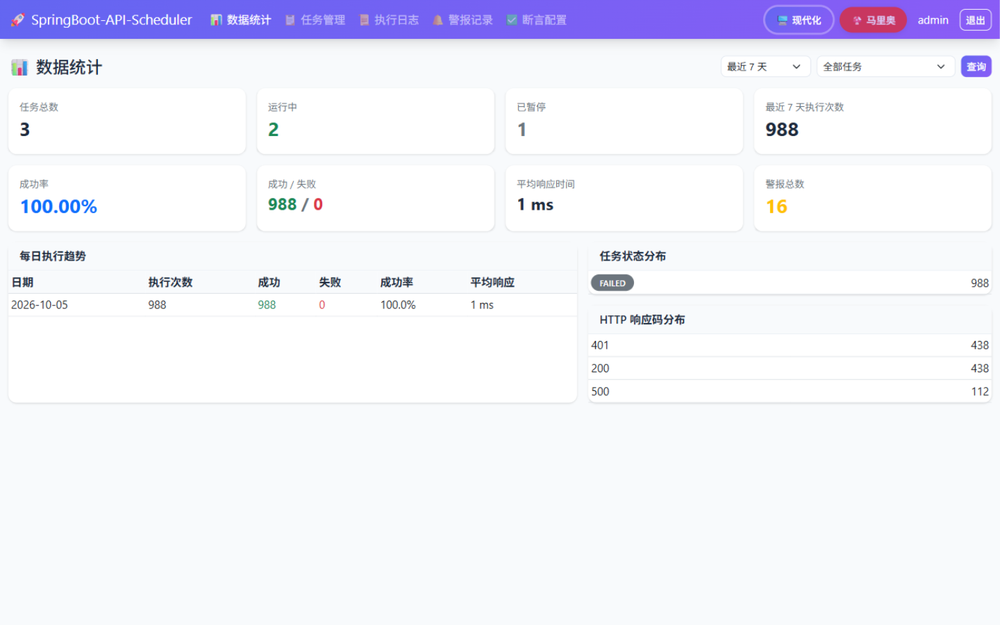
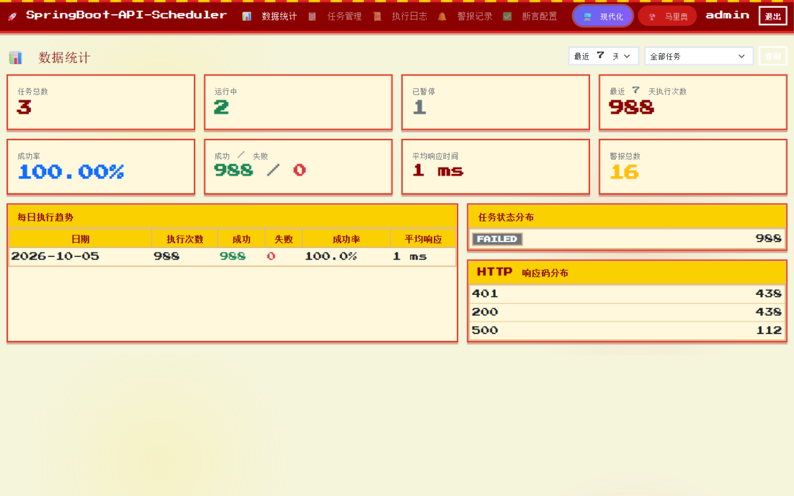
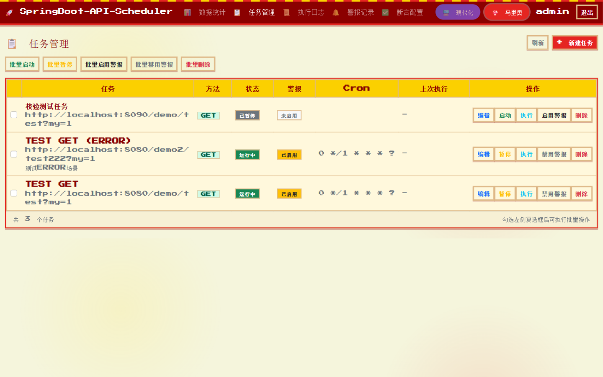
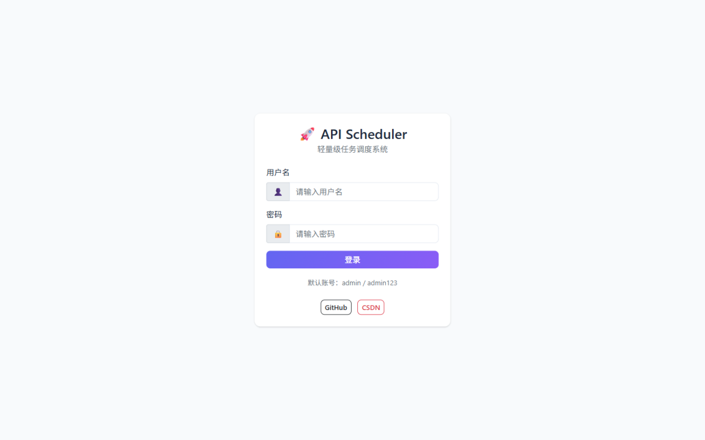
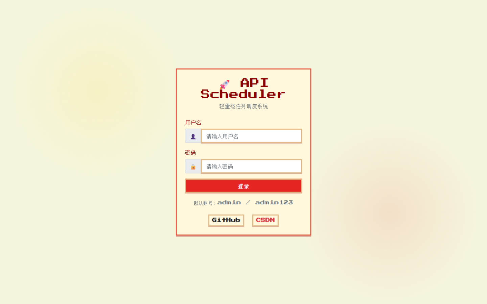

# 主题切换功能说明

## 功能介绍

本项目支持两种视觉主题，用户可随时切换，偏好保存在浏览器本地存储中：

### 1. 现代化主题 (默认)
- **特点**：简洁、专业、现代感强
- **配色方案**：
  - 主色调：紫色渐变 (#6366f1 → #8b5cf6)
  - 成功色：绿色 (#10b981)
  - 警告色：橙色 (#f59e0b)
  - 错误色：红色 (#ef4444)
- **设计元素**：圆角卡片、渐变导航栏、浮动阴影、平滑过渡动画

### 2. 马里奥像素风主题
- **特点**：复古游戏风格，趣味性强
- **配色方案**：
  - 主色调：马里奥红 (#e52521)
  - 辅助色：金币黄 (#fbd000)
  - 成功色：绿色 (#43b244)
  - 警告色：橙色 (#ff7f27)
- **设计元素**：像素化双边框卡片、红黄砖块导航条纹、按钮按下位移效果、Press Start 2P 复古像素字体（中文回退 Courier New）

## 效果预览

数据统计页 —— 现代化主题：



数据统计页 —— 马里奥像素风主题：



任务管理页 —— 马里奥像素风主题（像素字体下的表格与按钮样式）：



登录页 —— 两种主题对比：

<p>
  
  
</p>

## 使用方法

### 切换主题
1. 在导航栏右侧找到主题切换器
2. 点击「🖥️ 现代化」或「🍄 马里奥」按钮
3. 页面立即切换到对应主题
4. 用户偏好保存在浏览器 localStorage，刷新与下次访问依然生效

### 技术实现

- 使用 CSS 自定义属性（CSS Variables）管理主题颜色，全部组件样式只引用变量
- 通过 `<html data-theme="modern|mario">` 属性切换主题
- **主题预加载**：`layout.html` 的 `<head>` 内联脚本在渲染前读取 localStorage 并设置 `data-theme`，避免刷新闪烁
- **Alpine.js store** 管理当前主题：`Alpine.store('theme')`，按钮点击调用 `$store.theme.set('mario')`，同时写入 localStorage 与 `data-theme` 属性
- 本项目样式引用带版本参数 `themes.css?v=1.1`，更新样式后请递增版本号，防止浏览器使用缓存样式

## 文件结构

```
src/main/resources/
├── static/css/
│   └── themes.css          # 双主题变量 + 全部组件样式
└── templates/
    └── layout.html         # 主题预加载脚本、切换按钮、Alpine theme store
```

## 自定义主题

如需添加新主题：

1. 在 `themes.css` 中添加新的主题变量定义：

```css
:root[data-theme="your-theme"] {
    --primary-color: #your-color;
    --bg-primary: #your-bg-color;
    /* 更多变量参见 modern / mario 主题的完整变量清单 */
}
```

2. 在 `layout.html` 的导航栏中添加对应的切换按钮：

```html
<button type="button" class="theme-btn theme-your-theme"
        :class="{ active: $store.theme.current === 'your-theme' }"
        @click="$store.theme.set('your-theme')">🎨 你的主题名</button>
```

3. 为新主题按钮补一段配色样式（参考 `.theme-btn.theme-mario`），并为个别组件（如像素字体、表格边框）补充 `[data-theme="your-theme"]` 专属规则。

## 注意事项

- 主题切换实时生效，无需刷新页面
- 所有 Bootstrap 组件与自定义组件（卡片、表格、分页、模态框、Cron 助手）都会随主题更新
- 移动端已适配两种主题（马里奥主题下导航栏允许折行，避免像素字体撑破视口）
